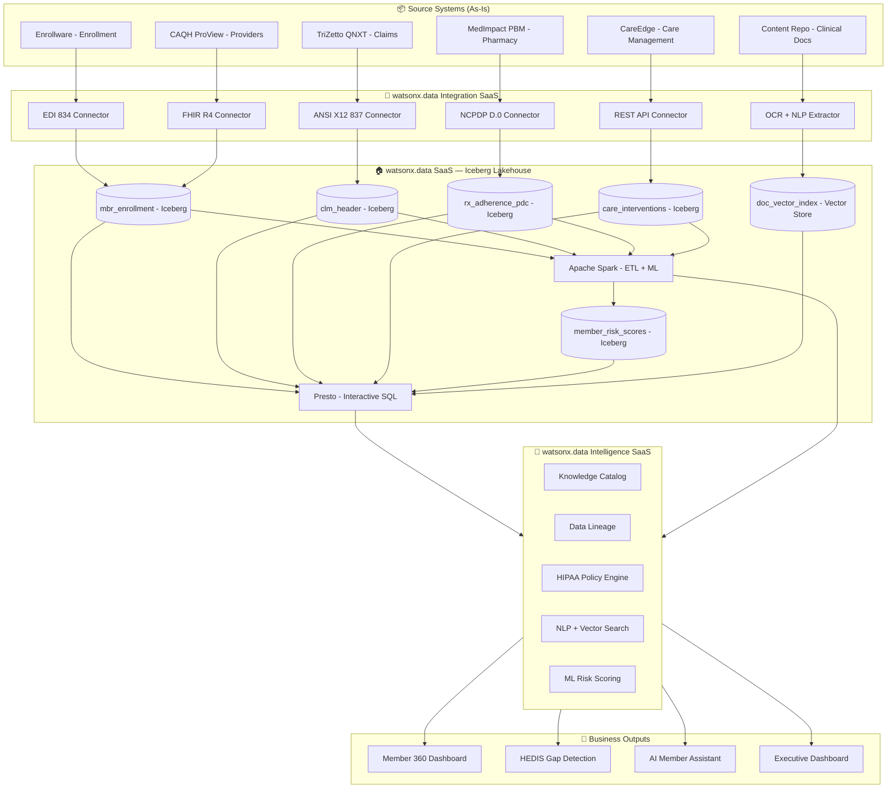

# Architecture — BCBS AL Member 360 Lakehouse

**Demo Code:** DEMO-BCBSAL-001 | **Platform:** IBM watsonx.data SaaS (Full Stack)

---

## Solution Summary

The BCBS AL Member 360 Lakehouse is a three-product IBM SaaS solution:

1. **watsonx.data SaaS** — The Iceberg lakehouse engine (storage + Presto/Spark query)
2. **watsonx.data Integration SaaS** — The pipeline engine (IBM App Connect connectors)
3. **watsonx.data Intelligence SaaS** — The governance and AI engine (IBM Knowledge Catalog + NLP + risk scoring)

Together they unify 6 fragmented source systems into a single Member 360 experience queryable in under 4 minutes (vs. 47 minutes today).

---

## Architecture Diagram



---

## Component Inventory

| Layer | Component | IBM Product | Role |
|-------|-----------|-------------|------|
| Source | TriZetto QNXT | (existing) | Medical & pharmacy claims adjudication |
| Source | CareEdge CM | (existing) | Care management & case tracking |
| Source | CAQH ProView | (existing) | Provider network directory |
| Source | MedImpact PBM | (existing) | Pharmacy benefit management + PDC |
| Source | Enterprise Content Repo | (existing) | Clinical documents, discharge summaries, PDFs |
| Integration | IBM App Connect (SaaS) | **watsonx.data Integration SaaS** | 100+ connectors; EDI, FHIR, NCPDP, REST |
| Integration | OCR + NLP Extractor | **watsonx.data Intelligence SaaS** | PDF → text → entities → vectors |
| Storage | Apache Iceberg v2 | **watsonx.data SaaS** | Open table format; ACID; time-travel |
| Storage | IBM Cloud Object Storage | **watsonx.data SaaS** | S3-compatible blob storage for Iceberg |
| Query | Presto | **watsonx.data SaaS** | Sub-second interactive OLAP SQL |
| Query | Apache Spark | **watsonx.data SaaS** | ETL, ML pipelines, PDC calculation |
| Intelligence | IBM Knowledge Catalog | **watsonx.data Intelligence SaaS** | Auto-profiling, data dictionary, lineage |
| Intelligence | Policy Engine | **watsonx.data Intelligence SaaS** | HIPAA masking, row-level access, audit |
| Intelligence | Vector Search + NLP | **watsonx.data Intelligence SaaS** | Clinical document semantic search |
| Intelligence | ML Risk Model | **watsonx.data Intelligence SaaS** | Member risk stratification (0–100) |
| AI (future) | watsonx.ai Foundation Model | watsonx.ai SaaS | LLM reasoning over unified member record |
| UI | Carbon React Frontend | (demo app) | Member 360 dashboard + AI assistant |

---

## Iceberg Data Model

```
member360 (catalog)
├── enrollment
│   └── mbr_enrollment      — member demographics, plan, PCP, effective dates
├── claims
│   ├── clm_header          — claim header (service date, facility, allowed)
│   ├── clm_diagnosis       — ICD-10 diagnosis codes per claim
│   └── clm_procedure       — CPT/HCPCS procedures
├── pharmacy
│   ├── rx_claims           — prescription fill history
│   └── rx_adherence_pdc    — PDC scores per drug per member
├── provider
│   └── provider_directory  — in-network providers, specialties
├── care
│   └── care_interventions  — open/closed care management programs
├── risk
│   └── member_risk_scores  — ML risk score + component factors
├── hedis
│   └── care_gap_registry   — open/closed gaps by HEDIS measure
└── documents
    └── doc_vector_index    — vectorized clinical documents (Intelligence NLP)
```

---

## Data Flow

1. **Source Extract** — IBM App Connect connectors pull from 5 structured systems on schedule (hourly for care management; 4-hr for claims/pharmacy; daily for enrollment/provider)
2. **OCR + NLP** — watsonx.data Intelligence extracts text from PDFs/TIFFs in the content repository, runs NLP entity extraction (diagnoses, medications, dates, provider names), and vectorizes
3. **Raw Landing** — Data lands in Parquet format in a raw zone on IBM Cloud Object Storage
4. **Iceberg Load** — Spark ETL jobs convert raw Parquet to Iceberg v2 tables with partition pruning and Z-ordering for query performance
5. **Enrichment** — Spark ML pipeline joins claims + pharmacy + care management → computes PDC scores, HEDIS gap status, member risk score
6. **Catalog + Governance** — watsonx.data Intelligence auto-profiles each table: column statistics, PII detection, quality scoring, business term assignment, lineage capture
7. **Consumption** — Presto serves sub-second SQL to the Member 360 dashboard; vector store serves the AI assistant's hybrid search (structured + unstructured)

---

## Security Architecture

| Control | Mechanism |
|---------|-----------|
| PHI Data Masking | watsonx.data Intelligence Policy Engine; masking applied at query time |
| Row-Level Security | Care managers see only their assigned members' full record |
| Audit Logging | All PHI table reads logged to IBM Log Analysis |
| Encryption at Rest | IBM Cloud Object Storage default AES-256 |
| Encryption in Transit | TLS 1.3 for all API and JDBC connections |
| HIPAA Minimum Necessary | AI assistant responses scoped to authorized member |
| NCQA Data Stewardship | Iceberg versioning; change approval workflow in Knowledge Catalog |

---

## Non-Functional Requirements

| NFR | Target | Mechanism |
|-----|--------|-----------|
| Member 360 load time | < 3 seconds | Presto + Iceberg Z-order + partition pruning |
| AI assistant response | < 3 seconds (mock); < 8 seconds (live LLM) | Vector pre-fetch + LLM streaming |
| Dashboard refresh | < 5 seconds | Presto pre-aggregated views |
| Ingestion lag (claims) | < 4 hours | App Connect 4-hr batch |
| Ingestion lag (care events) | < 1 hour | App Connect event-driven |
| Availability | 99.9% SLA | IBM SaaS managed services |
| HIPAA compliance | Full | Policy Engine + row-level security + audit |

---

## IBM Product Versions

| Product | Version / Tier | Deployment |
|---------|---------------|------------|
| watsonx.data | SaaS (Lite / Standard / Enterprise) | IBM Cloud US-South |
| watsonx.data Integration | SaaS (App Connect Standard) | IBM Cloud US-South |
| watsonx.data Intelligence | SaaS (Knowledge Catalog Standard) | IBM Cloud US-South |
| watsonx.ai (future) | SaaS | IBM Cloud US-South |
| Apache Iceberg | v2 (managed by watsonx.data) | Embedded |
| Presto | Managed by watsonx.data SaaS | Embedded |
| Apache Spark | Managed by watsonx.data SaaS | Embedded |
